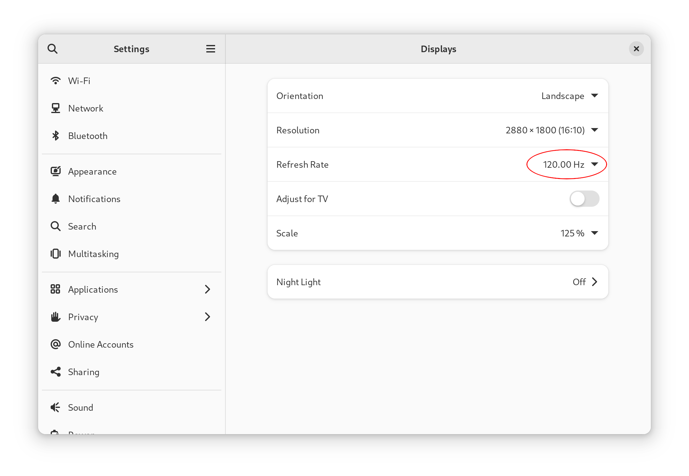

# Lenovo IdeaPad Pro 5 14" (14APH8) 120Hz Linux fix

Recently I got this laptop with 120hz 2880x1800 screen, but in Linux I could only select 60Hz. Windows did work with 120Hz out-of-the-box. I've set up this repo to share the problem description and provide a fix for this laptop with Linux.

## Does this fix apply to me?

Check the kernel log by executing `dmesg`. If it contains `[drm] DisplayID checksum invalid, remainder is 248`, you are probably affected by the same bug as me (see [Problem description](#problem-description)).

Note that the provided fixed EDID in this repository only applies to this laptop's screen model; you have to fix your own EDID if you encounter the same error with a different model. 

## Fix

As root:
1. Create a directory `/lib/firmware/edid/`.
2. Copy the fixed EDID `edid.bin` from this repository to `/lib/firmware/edid/`.
3. Ensure the fixed EDID gets included in your initramfs. For Debian and derivatives, you can use the `edid-firmware` initramfs hook from this repo: copy it to `/etc/initramfs-tools/hooks/`.
4. Recreate your initramfs, e.g. on Debian run: `update-initramfs -c -k all`.
4. Modify your kernel command line to use the fixed EDID by including `drm.edid_firmware=eDP-1:edid/edid.bin`. If you use GRUB as your bootloader, add this command to `GRUB_CMDLINE_LINUX_DEFAULT` in `/etc/default/grub` and run `update-grub` thereafter.
5. Reboot and verify you now have 120hz:



## Problem description

Modern display devices ship with a so-called [EDID](https://en.wikipedia.org/wiki/Extended_Display_Identification_Data) (Extended Display Identification Data) that describe the capabilities of the device, such as resolutions and refresh rates. It is a standard published by the VESA organization. The basic structure of the EDID has some limitations though, e.g. the maximum stored pixel clock, which influences the refresh rate among other properties, can be 655.35 MHz at most. To overcome this, VESA published 'extension blocks' that can describe display modes beyond the limitations of the basic structure. This laptop's 2880x1800 @ 120Hz display mode is described in such an extension block, to be precise in a [DisplayID](https://en.wikipedia.org/wiki/DisplayID) 1.3 extension block.

The extension block is verified by a checksum calculation so the driver can check if the block isn't corrupt. Unfortunately, this checksum is invalid, causing the 2880x1800 @ 120Hz mode to be disregarded in Linux, hence the `[drm] DisplayID checksum invalid, remainder is 248` error in your kernel log.

The problem can be fixed by overriding the built-in EDID with a fixed one, which is provided in this repository. It is crafted as follows:
1. Extract the original EDID: `cat /sys/class/drm/card0-eDP-1/edid > edid.original.bin`
2. Inspect the EDID with an hexdump: `hexdump -vC edid.original.bin`. The EDID is 256bytes big, of which the last 128 bytes are the extension block. The first two bytes of the extension block contain header identifiers, the last two bytes can be used to influence checksum calculation:
```
00000000  00 ff ff ff ff ff ff 00  0e 6f 16 14 00 00 00 00  |.........o......|
00000010  00 20 01 04 b5 1e 13 78  03 21 15 a8 53 49 9c 25  |. .....x.!..SI.%|
00000020  0f 50 54 00 00 00 01 01  01 01 01 01 01 01 01 01  |.PT.............|
00000030  01 01 01 01 01 01 ce 87  40 a0 b0 08 6a 70 30 20  |........@...jp0 |
00000040  36 00 2d bc 10 00 00 18  00 00 00 fd 00 28 78 e5  |6.-..........(x.|
00000050  e5 46 01 0a 20 20 20 20  20 20 00 00 00 fe 00 43  |.F..      .....C|
00000060  53 4f 54 20 54 33 0a 20  20 20 20 20 00 00 00 fe  |SOT T3.     ....|
00000070  00 4d 4e 45 30 30 37 5a  41 31 2d 35 0a 20 01 af  |.MNE007ZA1-5. ..|
00000080  70 13 79 00 00 03 01 14  9a 0f 01 05 3f 0b 9f 00  |p.y.........?...|
           \  \_ DisplayID block start. Should actually be 0x12 [1]
            \_ Extension block start
00000090  2f 00 1f 00 07 07 69 00  02 00 05 00 00 00 00 00  |/.....i.........|
000000a0  00 00 00 00 00 00 00 00  00 00 00 00 00 00 00 00  |................|
000000b0  00 00 00 00 00 00 00 00  00 00 00 00 00 00 00 00  |................|
000000c0  00 00 00 00 00 00 00 00  00 00 00 00 00 00 00 00  |................|
000000d0  00 00 00 00 00 00 00 00  00 00 00 00 00 00 00 00  |................|
000000e0  00 00 00 00 00 00 00 00  00 00 00 00 00 00 00 00  |................|
000000f0  00 00 00 00 00 00 00 00  00 00 00 00 00 00 f0 98  |................|
                             DisplayID checksum byte _/  /
                         Extension block checksum byte _/
00000100
```
3. Recalculate the checksum of the DiplayID extension block and then the surrounding extension block, and optionally fix the DisplayID magic value from 0x13 to 0x12:
```
--- edid.original.hex   2023-08-23 11:47:39.355357198 +0200
+++ edid.hex    2023-08-23 11:47:47.019450296 +0200
@@ -6,12 +6,12 @@
 00000050  e5 46 01 0a 20 20 20 20  20 20 00 00 00 fe 00 43  |.F..      .....C|
 00000060  53 4f 54 20 54 33 0a 20  20 20 20 20 00 00 00 fe  |SOT T3.     ....|
 00000070  00 4d 4e 45 30 30 37 5a  41 31 2d 35 0a 20 01 af  |.MNE007ZA1-5. ..|
-00000080  70 13 79 00 00 03 01 14  9a 0f 01 05 3f 0b 9f 00  |p.y.........?...|
+00000080  70 12 79 00 00 03 01 14  9a 0f 01 05 3f 0b 9f 00  |p.y.........?...|
 00000090  2f 00 1f 00 07 07 69 00  02 00 05 00 00 00 00 00  |/.....i.........|
 000000a0  00 00 00 00 00 00 00 00  00 00 00 00 00 00 00 00  |................|
 000000b0  00 00 00 00 00 00 00 00  00 00 00 00 00 00 00 00  |................|
 000000c0  00 00 00 00 00 00 00 00  00 00 00 00 00 00 00 00  |................|
 000000d0  00 00 00 00 00 00 00 00  00 00 00 00 00 00 00 00  |................|
 000000e0  00 00 00 00 00 00 00 00  00 00 00 00 00 00 00 00  |................|
-000000f0  00 00 00 00 00 00 00 00  00 00 00 00 00 00 f0 98  |................|
+000000f0  00 00 00 00 00 00 00 00  00 00 00 00 00 00 f9 90  |................|
 00000100
```

[1] [Source](https://en.wikipedia.org/wiki/DisplayID#DisplayID_1.3_structures)
